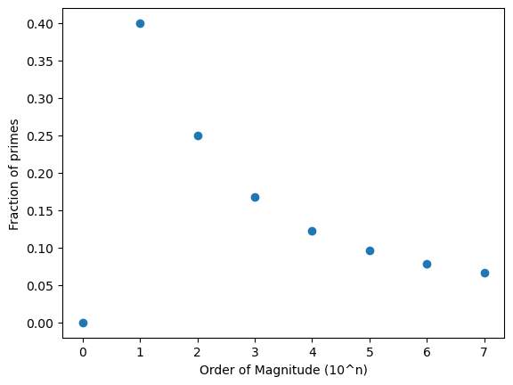

nbdev_sieve
================

<!-- WARNING: THIS FILE WAS AUTOGENERATED! DO NOT EDIT! -->

README file and the index of documentation.

## Install

``` sh
pip install nbdev_sieve
```

## How to use

For now, only the sieve(N: int) generator can be called

``` python
## Helper functions
def primes(N: int = 10):
    "get list of primes"
    return [p for p in sieve(N)]

print (primes(17))
```

    [2, 3, 5, 7, 11, 13, 17]

### Count primes at higher order of magnitude

[see prime counting
function](https://en.wikipedia.org/wiki/Prime-counting_function)

| n     | π(n)        |
|-------|-------------|
| 10^1  | 4           |
| 10^2  | 25          |
| 10^3  | 168         |
| 10^4  | 1,229       |
| 10^5  | 9,592       |
| 10^6  | 78,498      |
| 10^7  | 664,579     |
| 10^8  | 5,761,455   |
| 10^9  | 50,847,534  |
| 10^10 | 455,052,511 |

``` python
def prime_count(om: int = 8):
    "#primes < 10^om"
    return {n: len(primes(n)) for o in range(om) if(n:=10**o)}

π = prime_count()
π
```

    {1: 0,
     10: 4,
     100: 25,
     1000: 168,
     10000: 1229,
     100000: 9592,
     1000000: 78498,
     10000000: 664579}

``` python
import matplotlib.pyplot as plt
```

``` python
fig, ax = plt.subplots()
ax.scatter([math.log10(n) for n in π], [c/n for n, c in π.items()])
plt.xlabel("Order of Magnitude (10^n)")
plt.ylabel("Fraction of primes")
plt.show()
```


